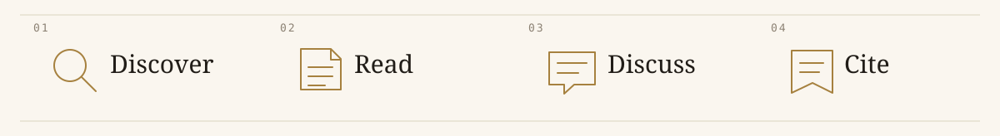
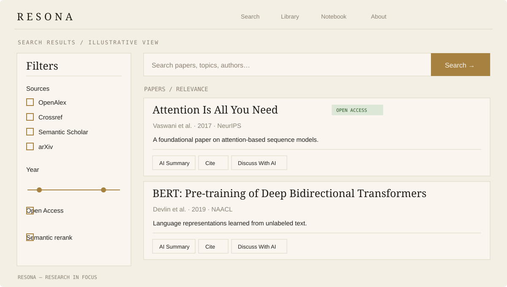
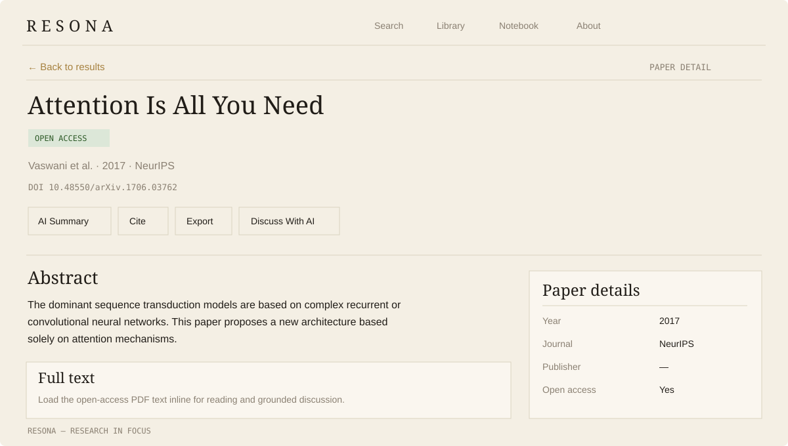

# Resona


**Research + Reasoning** — a local-first academic paper search engine for finding, reading, citing, and discussing research. Resona combines scholarly metadata from multiple public sources in a responsive editorial interface. The application has no database: searches are assembled on demand, while extracted full text and its embeddings are kept only in a bounded, process-local LRU cache.

You can run search, citations, and export without an API key, an LLM, or a GPU. An internet connection is needed for scholarly APIs and for the first download of the local embedding model. OpenAlex may rate-limit anonymous requests; a free key is optional but helpful. AI summaries and chat require either local [Ollama](https://ollama.com/) or an OpenAI API key.



## Interface

The editorial UI uses parchment surfaces, Fraunces headlines, compact metadata, and an ochre accent. The two views below are **layout illustrations**, not screenshots or live search output. The hero above recreates the homepage's repeating letterpress animation as a GIF for GitHub's README viewer.

**Search results** — source filters, optional semantic reranking, and ranked paper cards.



**Paper detail** — metadata, research actions, and inline full-text reading.



## What it does

- **Federated discovery:** Search OpenAlex by default, or opt into Crossref, Semantic Scholar, and arXiv. Results are normalized, deduplicated by DOI or fuzzy title and year, and merged across sources. If every requested source fails, search reports an upstream error instead of presenting an empty result set.
- **Hybrid ranking:** A paper's score is `0.5 × relevance + 0.3 × citation_score + 0.2 × recency_score`. Relevance averages reciprocal-rank signals across the sources that found it; citations use a log-scaled, fixed 10,000-citation ceiling. Optional semantic reranking uses local `fastembed` embeddings (`BAAI/bge-small-en-v1.5`) and reciprocal rank fusion with the original ordering.
- **Paper reading:** Open a dedicated paper detail page for metadata, authors, abstract, and actions. For an available open-access PDF, load extracted text inline. Extraction uses `pypdf`, is capped at 200,000 characters by default, and shares the same LRU cache with chat.
- **Grounded AI:** Generate summaries from paper metadata and discuss a paper through token-by-token Server-Sent Events (SSE). Chat retrieves relevant full-text excerpts when available, falls back to the abstract otherwise, and shows which grounding source it used. Ollama and OpenAI are optional providers.
- **Research tools:** Copy BibTeX or APA citations, export a single paper or an OpenAlex result batch to Excel, and optionally check DOI indexing in Scopus.
- **Editorial interface:** “Research, Restyled” pairs warm parchment and charcoal themes with a responsive filter sidebar. Submitted search terms, filters, and page number live in the URL, so returning from a paper restores the results.

## Architecture

Resona runs as two local services:

```text
Browser → Next.js frontend (web/, port 3000)
                ↓
          FastAPI backend (repo root, port 9999)
                ├─ /search → source adapters → normalize/deduplicate → rank → optional rerank
                ├─ /fulltext → PDF extraction → bounded in-memory LRU cache
                └─ /chat → cached text or abstract → retrieval → LLM → SSE tokens
```

The backend uses async `httpx` for upstream requests and does not store accounts or papers in a database. `main.py` registers routes and creates the shared HTTP client, embedding model, and full-text cache. `api/` holds route handlers; `services/` holds source adapters, federation, full-text retrieval, LLM calls, and export helpers. `schemas.py` defines the normalized internal paper shape, `ranking.py` computes scores, `reranking.py` performs optional semantic reranking, `models.py` defines API payloads. The `web/` directory contains the Next.js 16 / React 19 frontend and its hand-maintained API types.

## Run locally

Prerequisites: Python 3.10+, Node.js and npm, and internet access for scholarly APIs. The first backend start downloads the `fastembed` model; subsequent starts use the local model cache. A GPU is not required.

1. Clone the repository and set up the backend from its root:

   ```bash
   git clone https://github.com/sudoshivam/resona-demo.git
   cd resona-demo
   python -m venv .venv
   source .venv/bin/activate
   pip install -r requirements.txt
   cp .env.example .env
   python main.py
   ```

   On Windows PowerShell, replace `source .venv/bin/activate` with `.\.venv\Scripts\Activate.ps1` and `cp .env.example .env` with `Copy-Item .env.example .env`. The API runs at `http://127.0.0.1:9999`; interactive API docs are available at [`/docs`](http://127.0.0.1:9999/docs) in the default development environment.

2. In a second terminal at the repository root, start the frontend:

   ```bash
   cd web
   npm install
   cp .env.example .env.local
   npm run dev
   ```

   On Windows PowerShell, use `Copy-Item .env.example .env.local` for the copy step. Open [`http://localhost:3000`](http://localhost:3000). The supplied `web/.env.example` points `NEXT_PUBLIC_API_URL` to the local backend.

All settings below are optional. Set them in the root `.env` before starting the backend:

| Variable | Purpose |
| --- | --- |
| `LLM_PROVIDER` | `auto` (default: Ollama first, then OpenAI), `ollama`, or `openai`. |
| `OLLAMA_BASE_URL` / `OLLAMA_MODEL` | Local Ollama address and model; defaults to `http://localhost:11434` and `llama3.2`. Install Ollama and run `ollama pull llama3.2` to enable local AI. |
| `OPENAI_API_KEY` / `OPENAI_MODEL` | Optional OpenAI provider; default model is `gpt-4o-mini`. |
| `OPENALEX_EMAIL` | Your email for OpenAlex polite-pool requests. |
| `OPENALEX_API_KEY` | Free OpenAlex key to raise limits and avoid anonymous-search rate limits. |
| `SEMANTIC_SCHOLAR_API_KEY` | Raises Semantic Scholar's unauthenticated rate limit. |
| `SCOPUS_API_KEY` | Enables DOI indexing checks and the Scopus badge. |

Without an AI provider, search and non-AI research tools still work; AI controls are unavailable. Full-text reading requires a usable open-access **PDF** URL. HTML landing pages are not extracted. Individual paper lookup resolves OpenAlex IDs and DOIs through OpenAlex, so a federation-only record without either may not have a detail page. Bulk Excel export currently fetches up to 50 OpenAlex works; it does not export the full federated result set.

## API at a glance

| Route | Purpose |
| --- | --- |
| `GET /search` | Search and optionally federate sources, filter, paginate, and rerank papers. |
| `GET /paper/{paper_id}` | Look up one OpenAlex ID or DOI. |
| `POST /fulltext` | Load and cache extracted text from an open-access PDF. |
| `POST /summarize` | Generate an AI paper summary. |
| `POST /chat` | Stream grounded chat as SSE (`meta`, `token`, `done`/`error`). |
| `POST /cite` | Format one BibTeX or APA citation. |
| `POST /cite/batch` | Format citations for multiple papers. |
| `GET /export` | Download an OpenAlex search batch as Excel. |
| `POST /export/paper` | Download one paper as Excel. |
| `GET /scopus/check` | Check a DOI's Scopus indexing, when configured. |
| `GET /trending` | Get OpenAlex publication-year groups for a field. |
| `GET /health` | Report API and optional-provider availability. |

The backend calls OpenAlex author autocomplete internally when resolving an author filter; it does not expose an `/authors/autocomplete` route. See [`/docs`](http://127.0.0.1:9999/docs) for live request schemas in development.

## License

MIT — see [LICENSE](LICENSE).
